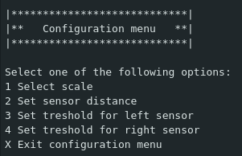
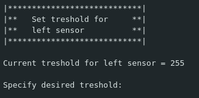
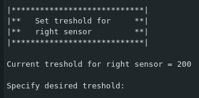
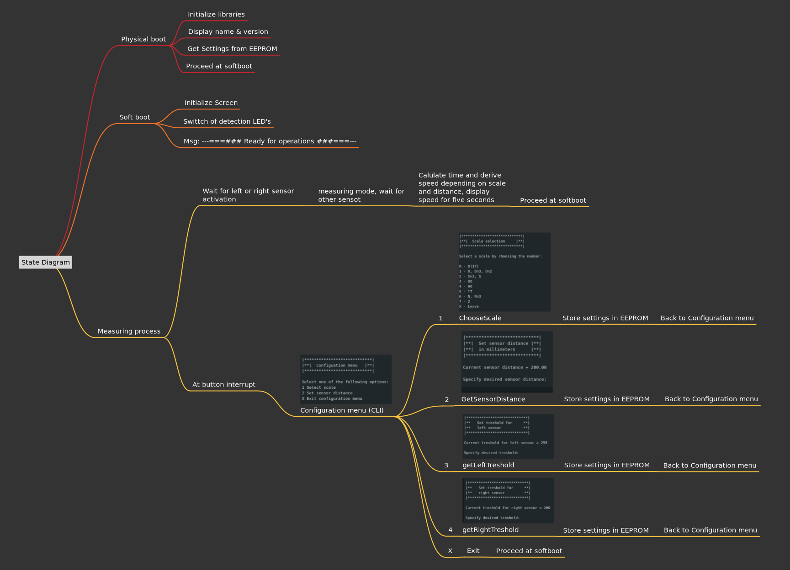
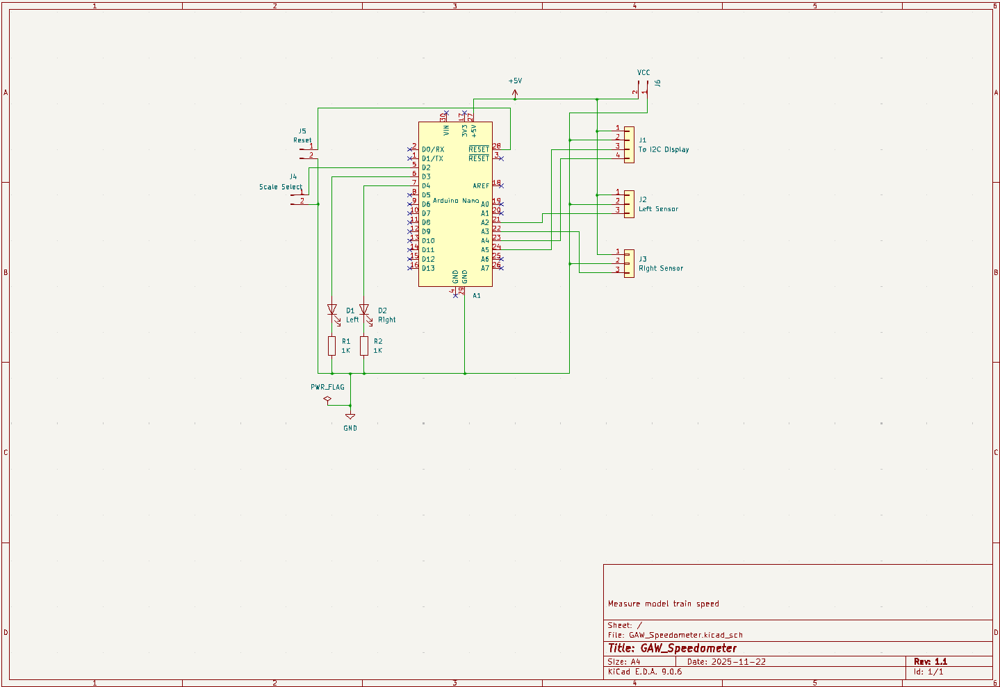

# GAW_Speedometer
This project is built to be able to measure model train speeds. 
The core is an Arduino nano. The output is going to an LCD 16x02 display. 
Two infrared sensors are used to pick up trains rolling by and measuring 
the milliseconds it takes from one to the other sensor. 
It works automaticly and bi-directional.
The result of a measurement stays available for 5 seconds.
After that the system reverts to automatic bi-directional measurement mode.

### Measurement
A measurement starts when one of the IR sensors is activated by a passing train.
The appropriate (left or right) LED will be switched on to indicate the start of the measurement.
The device now waits for the other sensor. 
It then measures the time it took for the train to reach the other sensor. 
As soon as the scond sensor is activated the scale-speed is calculated and displayed.

## Settings
A settings menu has been built in using the serial interface.
This menu can be reached by pressing the config button.
The main config menu looks like this:

## Scale
In model railroading the scale of course is important for the speed calculation. 
The default scale in this program is N-scale which is 1:160. 
This scale for the measurements can be altered to in total 8 NMRA scales (choice 1).
The scale selection menu looks as follows:

## Sensors
The device works with two IR sensors. These have a certain distance, and the program has to be aware of that.
To be able to set the distance of the sensors we can activate the second menu entry (2).
There we can enter the distance in mm between the sensors.
That looks like this:

## Sensors treshold
The treshold for the left (3) and right (4) sensors can be configured using the config menu.
Default value for both is 200.
That looks like this:

## Operation
See this state diagram for the functionality:

### Reset
The Reset button performs a hard reset of the Arduino,  creating a situation resembling a power off / power on.

## Schematic
A schematic is available to make your own: 

